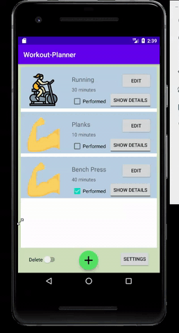

## Introduction

Workout Planner is android app for tracking workouts developed using Android Studio (Java). I used Firebase Realtime Database to store user sessions. Users can specify the category, duration, and name of their workouts and save them using the add button on the bottom-center, and the entries will appear as a list on the feed. Each session can be edited or deleted using the delete switch on the bottom left. The settings button on the bottom right allows the user to sort the workouts by the different parameters.
## Demo

